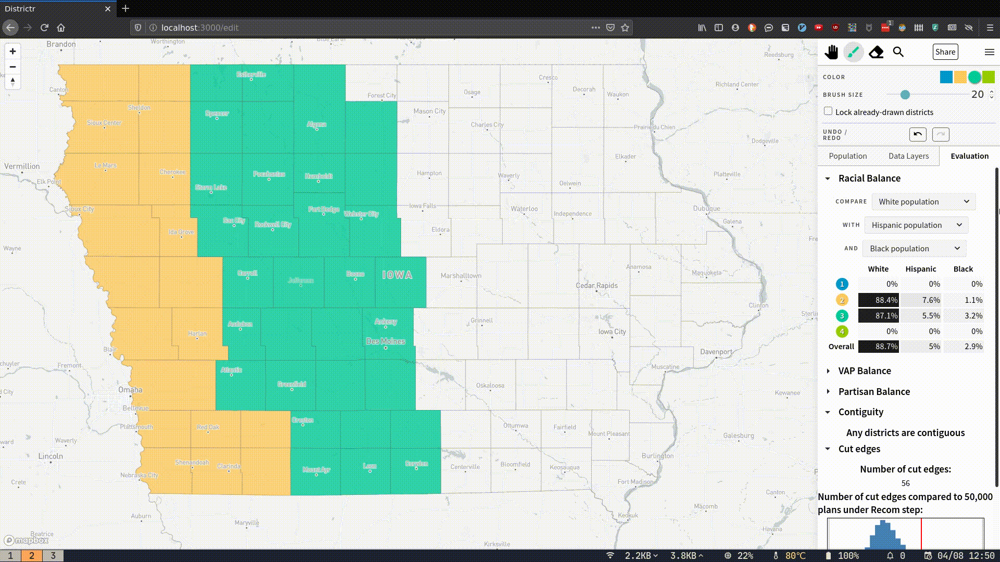

This week, I humanised the way that cut edges are presented, with help from
@Amy Becker and @Gabe Schoenbach. Having only the raw number of cut edges was
just not very informative, so Amy suggested that we compare it to the
distribution of cut edges that results from 50,000 steps of the Recom function.
Gabe wrote a script to generate the plans and the cut edges PNG. I integrated
it into the Districtr app. It all updates in real time, too. Check it out:



I want to extend this to other states, but I have the following problem:

1. How do I handle errors when generating the dual graph? Iowa has no islands, so
   it's OK, but Texas on the other hand gives the following error:

```
gerrychain.graph.geo.GeometryError: Invalid geometries at rows [3296, 5024, 5186, 6242, 6271] before reprojection. Consider repairing the affected geometries with `.buffer(0)`, or pass `ignore_errors=True` to attempt to create the graph anyways.
```

Still not sure how I should handle these errors.

**Moon's feedback**: This has been the bottleneck for several weeks already

I am resolving to run a script to see if there are _any_ states that fall out of the
